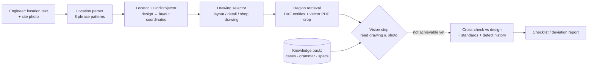

# AI Inspector

> **Status: early-stage, developed part-time (last active Sep 2026).** Steps ①–④ of the pipeline work. The drawing-reading step is not yet reliable with current multimodal models, and the next iteration packages the retrieval and detail-recognition workflow as a reusable skill / knowledge pack for the model. Personal project, sole developer. Code and data are not published (the drawings and inspection records belong to a completed project I worked on).

An AI assistant for "build-to-drawing" quality inspection on a construction site, adapted deeply to one project rather than a generic building-code chatbot. The idea came from two years as a site quality engineer: rectifying a defect is easy once found, and finding it depends on knowing, for every location, what the drawings say should be there. The target user is a junior engineer who walks onto a cluttered site with a phone and asks, in plain language, "what should I be checking here, and does it match the design?"

## What was built (May–Jul 2026)

- **Project ingestion**: DWG → DXF batch conversion, structured extraction with ezdxf (layers, ~30k text entities, 157+ prefabricated-component IDs, rebar schedules, dimension measurements), and per-layout vector PDF rendering (53 drawings for one tower in about 18 minutes).
- **Location language → grid coordinates**: a parser for eight ways engineers describe a location ("Tower 1, typical floor, under wall PCGQ6L") hitting 87% on 2,234 historical defect records, and a `Locator` + `GridProjector` chain that maps a description to grid cells across drawings that use different coordinate systems. Grid-axis indexing covers 87% of 356 plan-type drawings and 99% of the residential towers. Two gold-standard cases pass end to end (re-verified Sep 2026).
- **Retrieval**: multi-source weighted retrieval over project drawings, seven OCR'd national standards and the historical defect corpus, with grep-first lookup because vector search confuses near-synonyms (tie bars vs. stirrups).
- **Knowledge pack**: capability spec (15 items), four gold-standard reasoning cases with expected outputs, symbol grammar for national drawing conventions, workflow YAMLs — written so a runtime model can consume them, not just a chat session.

## Where it stands

The seven-step chain is: ① parse location → ② grid coordinates → ③ select the right drawing → ④ retrieve the region → **⑤ read the drawing / photo** → ⑥ cross-check → ⑦ report. Steps ①–④ work. Step ⑤ is where the prototype is paused, on all three fronts tested:

| Test | What the model had to do | Result |
|---|---|---|
| Design-drawing reading | On a six-view prefabricated wall panel detail, say which line is which rebar, decode project-specific colour conventions, and tell which segment a "670" dimension refers to | Unreliable; models confuse views and mis-attribute dimensions |
| Site-photo recognition | Identify the component, work stage and rebar in a site photo | Only coarse categories; not at the level a check requires |
| Cross-modal alignment | Match a site photo to the corresponding view in the detail drawing | Could not complete any step of the chain |

Two smaller dead ends are recorded as well: CAD → BIM reconstruction (no usable automation exists), and dimension text lost during DWG conversion (six rendering fixes failed; a post-hoc overlay via a projection matrix works but drifts if any of its parameters is off, so it must be computed once at ingestion, never live by the model).

The honest assessment today: without step ⑤, the system is an advanced document-retrieval and field-lookup tool for one project, not an inspector. That is useful, but not the product. The next step is to stop asking the model to read a whole sheet and instead hand it a skill: the knowledge pack (gold cases, symbol grammar, workflow YAMLs) that walks it through selecting the drawing, cropping the region and counting symbols, so that its judgement is applied to a small, well-framed input.

## Architecture

## Tech stack

Python · ezdxf · QCAD command-line tools (dwg2dwg, dwg2pdf) · PyMuPDF · OCR'd standards corpus · Claude / Qwen-VL for the vision experiments · YAML knowledge pack

## What I took from it

Choose the killer feature by what an experienced engineer actually does (find, not fix); build the deterministic parts first so the model's contribution can be measured in isolation; and when the measurement says the missing capability is the model's, not the pipeline's, change what you hand the model rather than the pipeline.
